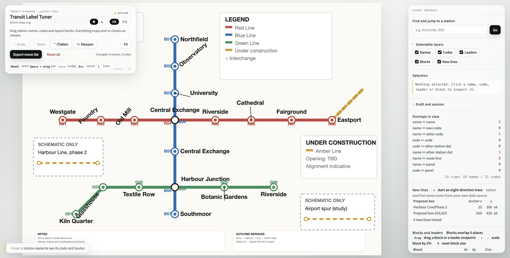

# Transit Label Tuner

A single-file, offline editor for the *last mile* of a transit diagram: the
station names, the code tags, the leader lines and the layout blocks that a
generator can position approximately but never quite right.

> **In one sentence:** it lets a human finish a generated transit diagram,
> then turns those visual decisions into data the generator can replay.

[繁體中文說明 → README.zh-TW.md](README.zh-TW.md)



<sub>Four verified combinations — [English dark](docs/screenshot-dark.png) · [Traditional Chinese light](docs/screenshot-zh.png) · [Traditional Chinese dark](docs/screenshot-zh-dark.png)</sub>

**It never writes SVG.** You drag things until the diagram reads well, and the
tool exports a *move list* — a plain-text table of offsets. Your own generator
re-renders the artwork from that table. The published diagram therefore stays
machine-generated and reproducible, while the human judgement that produced it
stays reviewable, diffable and replayable.

```
   your generator ──► diagram.svg ──► [ Transit Label Tuner ] ──► move-list.txt
          ▲                                                            │
          └────────────────────────────────────────────────────────────┘
                        applied on the next render
```

That loop is the whole point. Hand-editing the output of a generator is a
one-way door: the next regeneration throws your work away. A move list
survives regeneration.

## Who it is for

This is a specialist tool for people who generate transit or network diagrams
from code and still need a human eye for the final five percent. It is not a
general SVG editor and it is not a journey-planning app. Its job is narrower:
make manual layout judgement reproducible instead of disposable.

---

## Quick start

Any static file server will do — the tool reads its map with `fetch()`, which
browsers block on `file://`.

```sh
git clone https://github.com/aliceeeileaf19/transit-label-tuner.git
cd transit-label-tuner
python3 -m http.server 8000
# then open http://localhost:8000/
```

You get a fictional 19-station demo network. Drag a station name; the code and
leader follow, then snap on release. The panel on the right counts every
overlap currently in view. When you are happy, press **Export move list**.

To use your own diagram:

```
http://localhost:8000/?svg=path/to/your-diagram.svg
```

…and edit the `CONFIG` block at the top of `index.html` so the selectors match
your markup. See [The map contract](#the-map-contract).

### SVG trust boundary

Only open SVG files you trust. Before insertion, the tool parses the file as
SVG and removes scripts, event handlers, embedded HTML, animation elements and
external resource URLs. That is defence in depth, not a general-purpose
sandbox for hostile files. Removed active content is reported in the interface.

There is no telemetry and no third-party service receives your diagram. The
browser fetches only the SVG URL you selected and stores interface preferences
and diagram-specific drafts in local storage.

Interface language follows your browser and theme follows your operating
system; both can be switched from the header and are remembered. Add
`?lang=zh|en` or `?theme=dark|light` to force either one.

---

## What it actually does for you

| | |
|---|---|
| **Snapping you cannot escape** | Names snap their *offset* to whole units while keeping the original fractional baseline. Codes may only land on one of eight configured quadrants. Slanted labels may only sit on a configured angle ladder. A drag can never invent a value the drawing does not already use. |
| **Live collision counts** | Nine categories — name↔name, name↔code, code↔dot, name↔route line, name↔panel and so on — recounted for whatever is in view, using the same tests an offline checker would run. Hard violations turn red as you drag. |
| **Refusals with reasons** | Two stations sharing a name? Dragged past the offset limit? Sitting on the legend? The export says so, names the row, and explains why an applier would abort — instead of emitting something that fails hours later in a batch job. |
| **One undo timeline** | Names, codes, blocks, leaders, proposal boxes and traced lines all share one history. Ctrl/⌘+Z works across every kind of edit. |
| **Nothing lost** | Autosaves to `localStorage`, keyed to a fingerprint of the source diagram so a draft can never be applied to a different drawing. Sessions export and import as JSON. |
| **Scriptable** | Every interaction has a `window.*` hook that runs the *same* snap and guard path as the mouse, so drag behaviour can be tested headlessly. `tools/selftest.py` does exactly that. |

---

## The map contract

The tool needs to find five things in your SVG. Selectors are configurable;
the `data-*` attribute names are not.

```
<svg viewBox="0 0 1684 1188">              ← outer canvas: page layout only
  <svg viewBox="0 0 800 560">              ← inner map: ALL station geometry
    <path class="rt-red" d="…"/>           ← CONFIG.selectors.route

    <g class="stn-g"                       ← CONFIG.selectors.station
       data-name="Riverside" data-code="R05"
       data-x="430" data-y="260">          ← authoritative position
      <circle cx="430" cy="260" r="8"/>
    </g>

    <text class="lbl" x="430" y="246"      ← CONFIG.selectors.label
          text-anchor="middle">Riverside</text>

    <g class="stn-code"                    ← CONFIG.selectors.codeGroup
       data-name="Riverside" data-code="R05"
       data-station-x="430" data-station-y="260">
      <text x="430" y="272" text-anchor="middle">R05</text>
    </g>

    <line class="ldr" x1="430" y1="260"    ← CONFIG.selectors.leader
          x2="428" y2="230"/>                 x1,y1 on the station;
                                              x2,y2 near the label
    <g id="title-block">…</g>              ← CONFIG.blocks
  </svg>
  <g id="notes">…</g>                      ← blocks may also live on the canvas
</svg>
```

Rules worth knowing:

- **`data-x` / `data-y` are authoritative**, not the rendered `<circle>`. Every
  exported offset is measured from them.
- **Two nested `<svg>` elements are expected but not required.** The tool uses
  whichever `<svg>` wraps the station groups as its coordinate system; if
  there is only one, that one is used. All offsets are in *that* system's
  units.
- **Leaders are bound at load time**, by proximity: `x1,y1` within
  `limits.leaderStationEnd` of the station, `x2,y2` within
  `limits.leaderLabelEnd` of the label's original position. Once a name has
  been dragged, the pairing can no longer be recovered — so it is done once,
  up front.
- **Panels are any filled `<rect>` smaller than `limits.panelAreaRatio` of the
  canvas**, computed once at load and then frozen. Labels are not allowed to
  cover them. Your full-canvas background rect is above the threshold and is
  correctly ignored.
- **Proposal boxes** ("not to scale" insets) are found by the marker text in
  `CONFIG.schematic.marker` and the *smallest* rect containing it. Do not
  reason from "a big enough rect" — the background rect contains every marker
  and would swallow the whole map.

`tools/make_demo_map.py` generates a minimal conforming map; read it as the
executable version of this section.

---

## Configuration

Everything diagram-specific lives in one `CONFIG` object at the top of
`index.html`:

| Key | What it controls |
|---|---|
| `defaultSvg` | Map loaded when no `?svg=` is given |
| `selectors` | How to find stations, labels, code groups, leaders, routes |
| `slots` | The eight quadrants a code may occupy: `[dx, dy, text-anchor]` |
| `snapAngles` | The ladder that slanted labels step along |
| `blocks` | Draggable layout blocks: `{id, key}`, `key` indexes the translation table |
| `schematic` | Marker regex, anchor keys, corner setback for proposal boxes |
| `limits` | Max offset, panel area ratio, leader binding tolerances |
| `formatVersion` | Bumped when the move-list format changes; drafts check it |
| `sourceFingerprint` | Optional packaged SHA-256; the browser computes one when the placeholder is left intact |

### About `sourceFingerprint`

Ships as the literal `__SOURCE_SHA256__`. You may replace it with the SVG's
SHA-256 in a packaging step. If you leave the placeholder intact, the browser
hashes the fetched SVG at load time instead (with a deterministic fallback
where Web Crypto is unavailable), so drafts still stay separated by revision.

---

## Move list format

Python-style tuple rows, one section per kind of edit. It is a machine
artifact: **it stays in English whatever the interface language is set to.**

| Section | Contents |
|---|---|
| `NAME_MOVES` | label text, station name, station code, dx, dy, anchor, *original* angle, has-leader, why |
| `CODE_NUDGES` | station name, group `data-code`, code text, new quadrant, old quadrant, why |
| `CHAIN_ANGLES` | chain name, `[labels]`, old angle, new angle, why |
| `LAYOUT_NUDGE` / `LAYOUT_SCALE` | per-block offset and scale factor |
| `LEADER_NUDGE` | leader label-end offset, identified by its station end |
| `SCHEMATIC_ANCHOR` | top-left corner of each keyed proposal box |
| `NEW_LINE` | traced vertices and path data — geometry only |

Two conventions that will save you a debugging session:

- **The angle column in `NAME_MOVES` preserves the original angle.** It is
  filled in always, `None` when there is no rotation. Writing a *new* angle
  there makes a strict applier abort on "table says X, file says Y". Angle
  changes belong in `CHAIN_ANGLES`, which is why a label may legitimately
  appear in both sections.
- **Edit an existing row rather than appending a second one.** Two
  `NAME_MOVES` rows for one label should make an applier abort; two
  `CODE_NUDGES` rows will silently let the later one win.

The header carries the source filename, the format version and the source
fingerprint, so a move list is self-describing.

---

## Keyboard

| | |
|---|---|
| Wheel / Space+drag | zoom / pan |
| Arrow keys | nudge the selection by one unit (Shift: ten, for blocks) |
| `[` `]` `\` | flatten / steepen / restore the original angle |
| `+` `-` `R` | scale the selected block by 2% / reset its size |
| `L` | start an eight-direction trace — click vertices, `Backspace` undoes one, `Enter` finishes, `Esc` cancels |
| Ctrl/⌘+Z, Ctrl/⌘+Shift+Z | undo / redo across every kind of edit |
| `Esc` | deselect |

---

## Scripting hooks

Drag behaviour cannot be checked by a screenshot, so every interaction is also
reachable from a script — through the same code path, not around it.

```js
applyMove("Riverside|R05", 0, 18)   // name, by "text|code"
applyCodeMove("Central Exchange|B05|B05", -8, 1)
applyAngle("Foundry|R02", -50)
dragPx("Eastport|R08", 0, 40)       // synthesises a real mousedown/move/up
moveBlock("legend", -40, 0)
scaleBlock("legend", 1.05)
moveLeader(0, 2, -3)
moveSchem("Harbour Line|Phase 2", 10, 5)
traceLine([[100,100],[200,137],[260,60]])
exportMoves() ; exportText()
undo() ; redo() ; resetAll() ; recount()
```

URL parameters drive them in batch and publish JSON into hidden `<pre>` nodes:

| Parameter | Result node |
|---|---|
| `?test=` | `#testresult` (also `document.title`) |
| `?exttest=` | `#extresult` |
| `?ext2test=` | `#ext2result` |
| `?uitest=` | `#uitestresult` |

```sh
python3 tools/static_audit.py      # i18n, themes, demo contract, screenshots
python3 tools/selftest.py          # 22 checks, headless Chrome
python3 tools/make_demo_map.py     # regenerate the demo network
```

---

## Interface languages and themes

English and Traditional Chinese, in one table (`I18N` in `index.html`). Static
markup is translated through `data-i18n` / `data-i18n-attr`; runtime strings
call `t(key, params)`. Missing keys fall back to English and then to the key
itself, so a partial translation degrades visibly instead of printing blanks.

To add a locale: copy the `en` block, translate the values, and the switch
picks it up. The exported move list and the `Error()` messages from the
scripting hooks stay in English by design — the first is consumed by machines,
the second by developers.

Themes work the same way. Every theme-dependent value is a semantic custom
property declared under `:root[data-theme="light"]` and `:root[data-theme="dark"]`;
the rules that follow are written once and never name a raw colour. Switching
is a single attribute write, and a third theme is a third variable block rather
than a third copy of the stylesheet.

The diagram itself stays on light paper in both themes — it is the document
being edited, not part of the chrome — and so do the drag-state colours drawn
on top of it.

---

## Why this exists

I built this for myself, while drawing a large 2D transit diagram.

The diagram came out of a generator, and the generator was good at everything
except the last five percent — the station names that ended up on top of a
route line, the code tag on the wrong side of a dot, the legend sitting where
a label needed to go. Fixing those by hand in the SVG worked exactly once:
the next regeneration threw all of it away.

So the tool refuses to write SVG at all. It records *what you decided* rather
than *what you drew*, and hands that back as a table the generator can replay
forever. Everything else here — the snapping that will not let you invent a
value the drawing does not already use, the live overlap counts, the export
that tells you which row is unusable and why — came from the same place:
mistakes that were expensive to find hours later, and cheap to prevent at the
moment of the drag.

---

## Known limitations

- Dragging is mouse-only. Keyboard users can nudge a *selected* item with the
  arrow keys, but there is no Tab order across station names yet.
- The overlap count is O(n²) over what is in view. On a diagram with thousands
  of labels the first pass is noticeably slow; it runs in the background and
  export unlocks when it finishes.
- Parsing a large embedded SVG is the dominant cost on first open, and is not
  yet streamed or split.
- Undo stores full snapshots rather than deltas, capped at 200 steps.

---

## License

MIT — see [LICENSE](LICENSE). Contributions welcome; please read
[CONTRIBUTING.md](CONTRIBUTING.md) first — several apparent gaps in this
tool are deliberate, and that file says which ones and why.

Techniques used and their canonical sources are listed in
[CREDITS.md](CREDITS.md). No third-party code, fonts or images are bundled;
the tool has no dependencies, telemetry or third-party network service.
