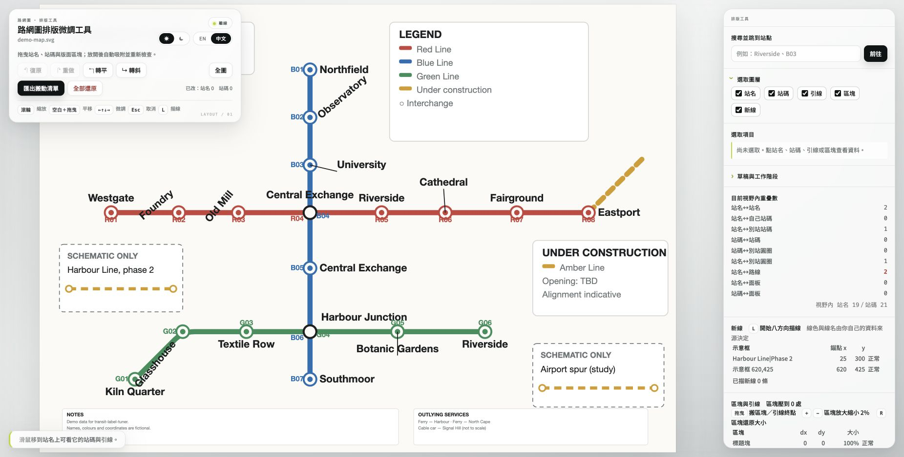

# 路網圖排版微調工具 Transit Label Tuner

單檔、離線的路網圖「最後一哩」編輯器：站名、站碼、引線與版面區塊——這些程式能排到
大致正確、但永遠差最後一點的東西。

> **一句話說明：**讓人完成程式產生的路網圖，再把這些視覺判斷轉成產圖程式可以重播的資料。

[English → README.md](README.md)



<sub>四種組合皆已驗證——[中文深色](docs/screenshot-zh-dark.png) · [英文淺色](docs/screenshot-en.png) · [英文深色](docs/screenshot-dark.png)</sub>

**它不產出 SVG。** 你拖到圖好看為止，工具匯出一份**搬動清單**（純文字的位移表），
再由你自己的產圖程式重新繪製。成品因此永遠是機器生成、可重現的，而人做的判斷則變成
可審閱、可 diff、可重播的文字。

```
   你的產圖程式 ──► diagram.svg ──► [ 排版微調工具 ] ──► move-list.txt
        ▲                                                    │
        └────────────────────────────────────────────────────┘
                      下一次重繪時套用
```

這個迴圈就是全部的重點。手改產圖程式的輸出是一扇單向門：下次重新產圖，你的工作就沒
了。搬動清單活得過重新產圖。

## 這是給誰用的

這是一個專門工具，給「用程式產生路網圖或網路圖，但最後百分之五仍需要人眼判斷」的人。
它不是通用 SVG 編輯器，也不是乘客查路線的 App；它只專心做一件事：讓人工排版判斷可以
被程式重現，而不是下次產圖就消失。

---

## 快速開始

任何靜態檔案伺服器都可以——工具用 `fetch()` 讀地圖，而瀏覽器在 `file://` 下會擋。

```sh
git clone https://github.com/aliceeeileaf19/transit-label-tuner.git
cd transit-label-tuner
python3 -m http.server 8000
# 然後開 http://localhost:8000/
```

會看到一份虛構的 19 站示範路網。拖一顆站名，站碼與引線會跟著走，放開時各自吸附。
右側面板即時統計目前視野內的所有重疊。滿意了就按 **匯出搬動清單**。

要換成自己的圖：

```
http://localhost:8000/?svg=path/to/your-diagram.svg
```

……並修改 `index.html` 最上方的 `CONFIG`，讓選擇器對得上你的標記。見
[地圖規格](#地圖規格)。

### SVG 信任邊界

只開啟你信任的 SVG。工具會先用 SVG 模式解析檔案，移除 script、事件屬性、嵌入 HTML、
動畫元素與外部資源網址，再放進頁面；介面會提示移除了幾項。這是額外防護，不代表它是
可以安全分析任意惡意檔案的通用沙盒。

工具沒有遙測，也不會把地圖送到第三方服務。瀏覽器只讀取你指定的 SVG 網址，並在本機
儲存介面偏好與各圖稿的草稿。

介面語言預設跟隨瀏覽器、配色主題預設跟隨作業系統，兩者都可以在標題列切換並會記住。
加 `?lang=zh|en` 或 `?theme=dark|light` 可強制指定。

---

## 它實際幫你做什麼

| | |
|---|---|
| **躲不掉的吸附** | 站名把**位移**吸到整數 unit，同時保留原本的小數基準。站碼只能落在八個設定好的象限之一。斜排標籤只能停在設定好的角度階梯上。拖曳永遠無法產生圖面上原本不存在的值。 |
| **即時碰撞統計** | 九個類別——站名↔站名、站名↔站碼、站碼↔圓圈、站名↔路線、站名↔面板等——只算視野內，用的是離線檢查器會用的同一套判定。硬性違規在拖的當下就變紅。 |
| **拒絕時說明理由** | 兩站同名？超過位移上限？壓在圖例上？匯出時會明講是哪一列、為什麼套用器會中止——而不是丟出一份幾小時後才在批次作業裡爆掉的清單。 |
| **單一復原時間線** | 站名、站碼、區塊、引線、示意框、描的新線共用一條歷史。Ctrl/⌘+Z 跨所有類型都有效。 |
| **不會弄丟東西** | 自動存入 `localStorage`，key 綁定來源圖的指紋，草稿因此不可能被套到另一張圖上。工作階段可匯出／匯入 JSON。 |
| **可被腳本驅動** | 每個互動都有 `window.*` 入口，走的是**和滑鼠同一條**吸附與守門路徑，所以拖曳行為可以無頭測試。`tools/selftest.py` 做的就是這件事。 |

---

## 地圖規格

工具需要在你的 SVG 裡找到五種東西。選擇器可設定，`data-*` 屬性名稱不可。

```
<svg viewBox="0 0 1684 1188">              ← 外層畫布：只負責版面尺寸
  <svg viewBox="0 0 800 560">              ← 內層地圖：所有站點幾何都在這
    <path class="rt-red" d="…"/>           ← CONFIG.selectors.route

    <g class="stn-g"                       ← CONFIG.selectors.station
       data-name="Riverside" data-code="R05"
       data-x="430" data-y="260">          ← 權威座標
      <circle cx="430" cy="260" r="8"/>
    </g>

    <text class="lbl" x="430" y="246"      ← CONFIG.selectors.label
          text-anchor="middle">Riverside</text>

    <g class="stn-code"                    ← CONFIG.selectors.codeGroup
       data-name="Riverside" data-code="R05"
       data-station-x="430" data-station-y="260">
      <text x="430" y="272" text-anchor="middle">R05</text>
    </g>

    <line class="ldr" x1="430" y1="260"    ← CONFIG.selectors.leader
          x2="428" y2="230"/>                 x1,y1 貼站點；x2,y2 靠近站名

    <g id="title-block">…</g>              ← CONFIG.blocks
  </svg>
  <g id="notes">…</g>                      ← 區塊也可以放在外層畫布
</svg>
```

幾條值得先知道的規則：

- **`data-x` / `data-y` 才是權威座標**，不是畫出來的 `<circle>`。所有匯出的位移都是
  以它們為基準量的。
- **預期有兩層 `<svg>`，但不強制。** 工具會拿「包住站點群組的那一顆 `<svg>`」當座標
  系；只有一層就用那一層。所有位移都以**那個座標系**的 unit 為單位。
- **引線在載入時就綁定**，靠距離判定：`x1,y1` 落在站點的 `limits.leaderStationEnd`
  內，`x2,y2` 落在站名原位的 `limits.leaderLabelEnd` 內。站名一旦被拖走就再也配不回
  去，所以這件事只在一開始做一次。
- **面板＝任何面積小於 `limits.panelAreaRatio` 的填色 `<rect>`**，載入時算一次就凍
  結。站名不得覆蓋它們。整張圖的背景 rect 因為超過門檻，會被正確忽略。
- **示意框**（「僅為示意」那種插圖）靠 `CONFIG.schematic.marker` 的標記文字，以及
  **包含它的最小 rect** 來定位。不要用「夠大的 rect」去反推——背景 rect 包含所有標
  記文字，會一口氣把整張圖吞掉。

`tools/make_demo_map.py` 會產生一份最小的合規地圖，可以當作本節的可執行版本來讀。

---

## 設定

所有跟特定圖有關的東西，都集中在 `index.html` 最上方的 `CONFIG`：

| 鍵 | 控制什麼 |
|---|---|
| `defaultSvg` | 沒給 `?svg=` 時載入的地圖 |
| `selectors` | 如何找到站點、站名、站碼群組、引線、路線 |
| `slots` | 站碼可佔的八個象限：`[dx, dy, text-anchor]` |
| `snapAngles` | 斜排標籤可停的角度階梯 |
| `blocks` | 可拖曳的版面區塊：`{id, key}`，`key` 對應翻譯表 |
| `schematic` | 示意框的標記正則、anchor key、圓角 setback |
| `limits` | 位移上限、面板面積比例、引線綁定容差 |
| `formatVersion` | 搬動清單格式改版時遞增；草稿會檢查 |
| `sourceFingerprint` | 可在打包時填入 SVG 的 SHA-256；保留 placeholder 時瀏覽器會自行計算 |

### 關於 `sourceFingerprint`

出廠值是字面上的 `__SOURCE_SHA256__`。你可以在建置步驟換成 SVG 的 SHA-256；若保留
placeholder，瀏覽器會在載入 SVG 時自行計算指紋（Web Crypto 不可用時改用固定的雜湊
fallback），因此不同圖稿版本仍會使用不同的草稿與工作階段識別。

---

## 搬動清單格式

Python 風格的 tuple 列，每種編輯一個區段。這是**機器產物：不論介面語言設成什麼，它
一律是英文。**

| 區段 | 內容 |
|---|---|
| `NAME_MOVES` | 標籤文字、所屬站名、站碼、dx、dy、anchor、**原**角度、有無引線、理由 |
| `CODE_NUDGES` | 站名、群組 `data-code`、站碼文字、新象限、原象限、理由 |
| `CHAIN_ANGLES` | 鏈名、`[標籤…]`、原角度、新角度、理由 |
| `LAYOUT_NUDGE` / `LAYOUT_SCALE` | 各區塊的位移與縮放倍率 |
| `LEADER_NUDGE` | 引線「站名端」的位移，用站點端定位 |
| `SCHEMATIC_ANCHOR` | 每個有 key 的示意框左上角座標 |
| `NEW_LINE` | 描線的折點與 path 資料——只有幾何 |

兩條會替你省下一整晚除錯的慣例：

- **`NAME_MOVES` 的角度欄是用來「保住原角度」的。** 它一律要填值，沒有旋轉就填
  `None`。在那裡填**新**角度，會讓嚴格的套用器以「表上寫 X、檔案裡是 Y」中止。角度
  變更屬於 `CHAIN_ANGLES`——這也是為什麼同一顆標籤同時出現在兩個區段是合法的。
- **請改寫既有那一列，不要再加一列。** 同一顆標籤兩列 `NAME_MOVES` 應該讓套用器中
  止；兩列 `CODE_NUDGES` 則會安靜地讓後面那列蓋掉前面那列。

檔頭帶著來源檔名、格式版本與來源指紋，所以一份搬動清單是自我描述的。

---

## 鍵盤

| | |
|---|---|
| 滾輪／空白＋拖曳 | 縮放／平移 |
| 方向鍵 | 選取項目微調一個 unit（區塊按 Shift 為十個） |
| `[` `]` `\` | 轉平／轉斜／回到原角度 |
| `+` `-` `R` | 選取的區塊縮放 2%／還原大小 |
| `L` | 開始八方向描線——點擊放折點，`Backspace` 退一點，`Enter` 完成，`Esc` 取消 |
| Ctrl/⌘+Z、Ctrl/⌘+Shift+Z | 跨所有編輯類型的復原／重做 |
| `Esc` | 取消選取 |

---

## 程式化介面

拖曳行為沒辦法用截圖驗證，所以每個互動都可以從腳本呼叫——走的是同一條路徑，不是繞
過它。

```js
applyMove("Riverside|R05", 0, 18)   // 站名，key 為「文字|站碼」
applyCodeMove("Central Exchange|B05|B05", -8, 1)
applyAngle("Foundry|R02", -50)
dragPx("Eastport|R08", 0, 40)       // 合成真實的 mousedown/move/up
moveBlock("legend", -40, 0)
scaleBlock("legend", 1.05)
moveLeader(0, 2, -3)
moveSchem("Harbour Line|Phase 2", 10, 5)
traceLine([[100,100],[200,137],[260,60]])
exportMoves() ; exportText()
undo() ; redo() ; resetAll() ; recount()
```

URL 參數可批次驅動它們，結果以 JSON 寫進隱藏的 `<pre>` 節點：

| 參數 | 結果節點 |
|---|---|
| `?test=` | `#testresult`（同時寫入 `document.title`） |
| `?exttest=` | `#extresult` |
| `?ext2test=` | `#ext2result` |
| `?uitest=` | `#uitestresult` |

```sh
python3 tools/static_audit.py      # i18n、主題、示範圖契約、截圖格式
python3 tools/selftest.py          # 22 項檢查，用無頭 Chrome
python3 tools/make_demo_map.py     # 重新產生示範路網
```

---

## 介面語言與主題

英文與繁體中文共用一張表（`index.html` 裡的 `I18N`）。靜態標記透過 `data-i18n` /
`data-i18n-attr` 翻譯；執行期字串呼叫 `t(key, params)`。找不到的 key 會退回英文、再
退回 key 本身，所以翻到一半的語言是「看得出來哪裡沒翻」，而不是印出一片空白。

要新增語言：複製 `en` 區塊、翻譯值，切換器就會認得。匯出的搬動清單與程式化介面丟出
的 `Error()` 訊息刻意維持英文——前者給機器讀，後者給開發者讀。

主題的做法一樣。所有隨主題改變的值都是宣告在 `:root[data-theme="light"]` 與
`:root[data-theme="dark"]` 底下的語意 token；後面的規則只寫一次，而且不會出現任何寫死
的顏色。切換主題就是改一個屬性，要加第三種主題也只是多一組變數，不是多一份樣式表。

地圖本身在兩種主題下都維持淺色紙面——它是被編輯的文件，不是介面的一部分——畫在它上
面的拖曳狀態顏色同理。

---

## 這支工具為何存在

這是我畫一張大型 2D 路網圖時，做給自己用的。

圖是程式產的，而程式什麼都好，就是差最後那 5%——壓在路線上的站名、跑到圓圈另一側的
站碼、正好卡在標籤該去的位置的圖例。直接手改 SVG 只能爽一次：下一次重新產圖，全部
歸零。

所以這支工具乾脆完全不寫 SVG。它記的是**你決定了什麼**，而不是**你畫了什麼**，然後把
那份決定交還成一張產圖程式可以永遠重播的表。其他設計也都出自同一個地方：那些幾小時
後才在批次作業裡爆出來、代價很高的錯誤，其實在拖曳的當下擋掉最便宜——像是不讓你吸到
圖面上原本不存在的值、即時的重疊統計，以及會明講「哪一列不能用、為什麼」的匯出。

---

## 已知限制

- 拖曳只支援滑鼠。鍵盤使用者可以用方向鍵微調**已選取**的項目，但還沒有跨站名的 Tab
  巡覽順序。
- 碰撞統計是視野內的 O(n²)。在有數千個標籤的圖上，第一輪明顯偏慢；它在背景執行，完
  成後才解鎖匯出。
- 首次開啟的主要成本是解析大型內嵌 SVG，尚未做串流或拆檔。
- 復原存的是完整快照而非 delta，上限 200 步。

---

## 授權

MIT，見 [LICENSE](LICENSE)。歡迎貢獻，動手前請先看 [CONTRIBUTING.md](CONTRIBUTING.md)——
這支工具有幾個「看起來像漏洞」的地方其實是刻意的，那份文件寫了是哪些、以及為什麼。

用到的技術方法與其權威出處列在 [CREDITS.md](CREDITS.md)。本工具不內含任何第三方程
式碼、字型或圖片，無相依套件、無遙測，也不連接第三方網路服務。
